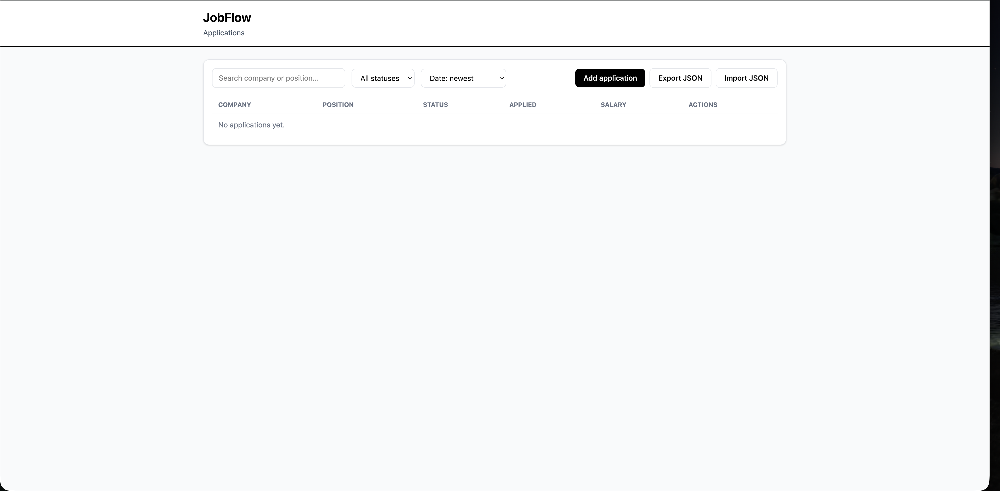
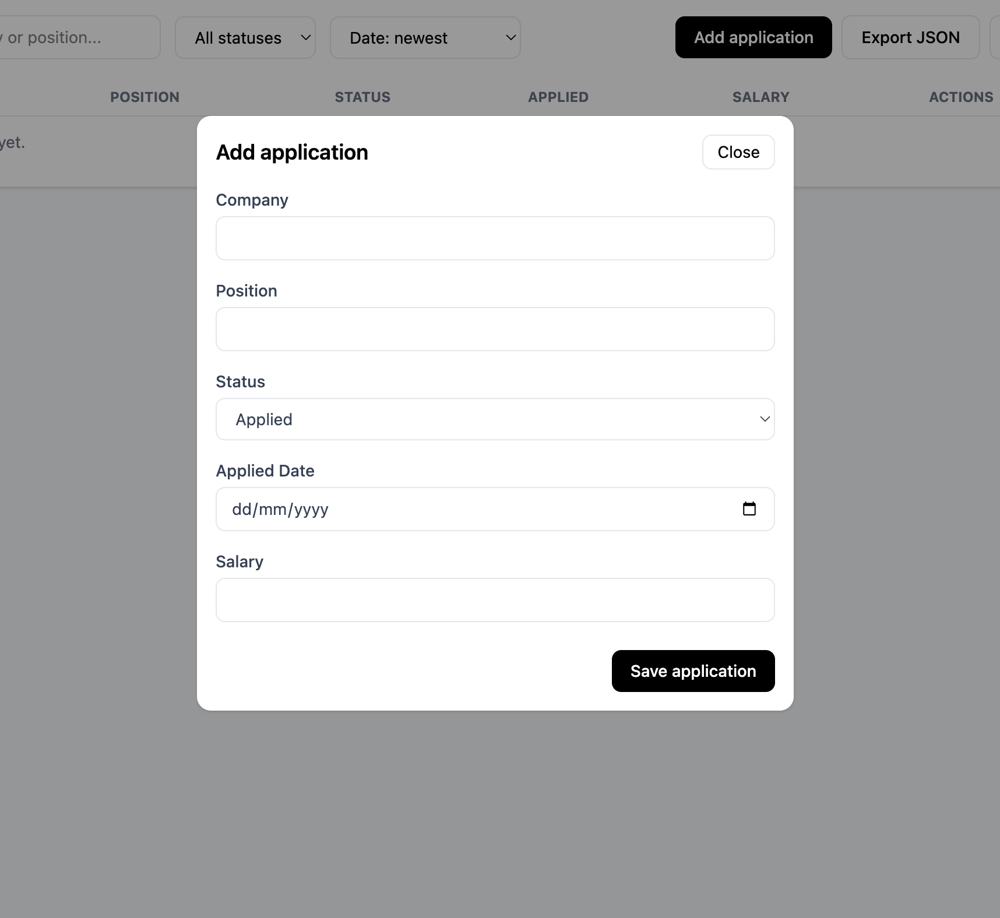

# JobFlow

Small app to track job applications.

It lets you add, edit and delete applications.
You can search, filter and sort them.
Data is saved in localStorage.

---

## Features

- Add, edit, delete applications
- Simple form validation
- Search by company or position
- Filter by status
- Sort by date or salary
- Import / export JSON

---

## Structure

src/
main.js
js/
state.js
ui.js
storage.js
css/
style.css

---

## Run

npm install  
npm run dev

---

## Build

npm run build  
npm run preview

---

## Live Demo

🔗 https://jobflow-nu.vercel.app/

---

## Screenshots

### Dashboard

### Add Application Modal

---

## Author

Vitalii Fedunyk - [@vitaliifedunyk](https://github.com/vitaliifedunyk)
